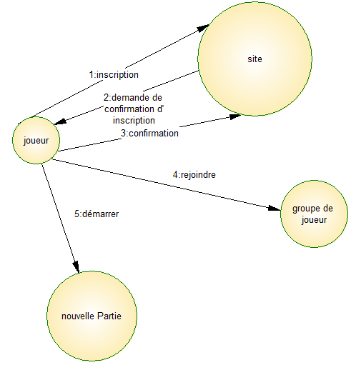
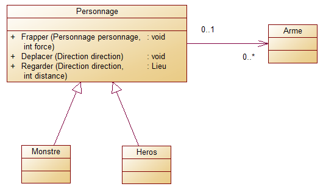
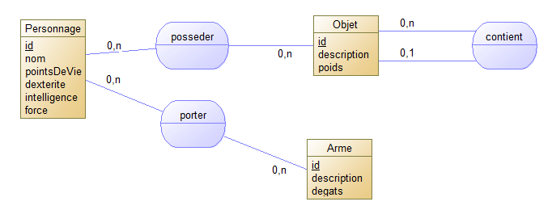
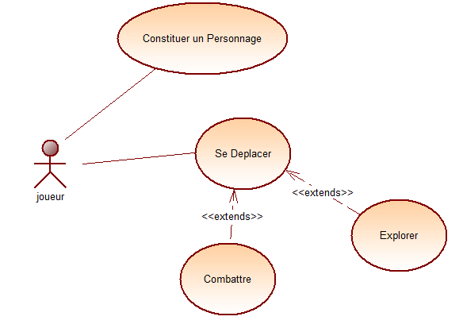

# **Git**
### Git est un logiciel de gestion de versions décentralisé.
#### Git possède deux structures de données : 
* une base d'objets
* un cache de répertoires.

#### Le joueur possèdera les fonctionnalités suivantes :
 
#### Les classes développés :

#### La sauvegarde du contexte se fera dans la base de données.

#### Cas d'utilisation des fonctionnalités à développer :

|   Working directory   |   Staging index   |   Local repository    |
|   ------------------  |   :-----------:   |   ----------------:   |
|   Unstaged            |   staged          |   unmodified          |

#### Git dispose notamment des commandes suivantes :

* git init​ crée un nouveau dépôt ;
* git clone​ clone un dépôt distant ;
* git add​ ajoute de nouveaux objets blobs dans la base des objets pour chaque fichier modifié depuis le dernier commit. Les objets précédents restent inchangés ;
* git commit​ intègre la somme de contrôle SHA-1 d'un objet tree et les sommes de contrôle des objets commits parents pour créer un nouvel objet commit ;
* git branch​ liste les branches ;
* git merge​ fusionne une branche dans une autre ;
* git rebase​ déplace les commits de la branche courante devant les nouveaux commits d’une autre branche ;
* git log​ affiche la liste des commits effectués sur une branche ;
* git push​ publie les nouvelles révisions sur le remote. (La commande prend différents paramètres) ;
* git pull​ récupère les dernières modifications distantes du projet (depuis le Remote) et les fusionne dans la branche courante ;
* gitgit stash​ stocke de côté un état non commité afin d’effectuer d’autres tâches.